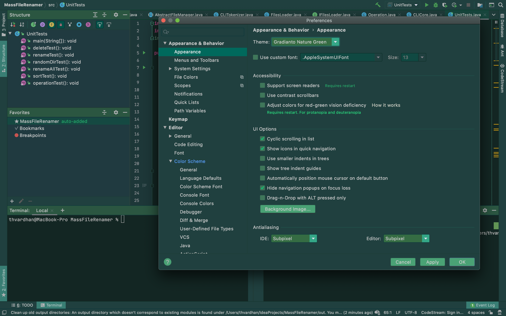
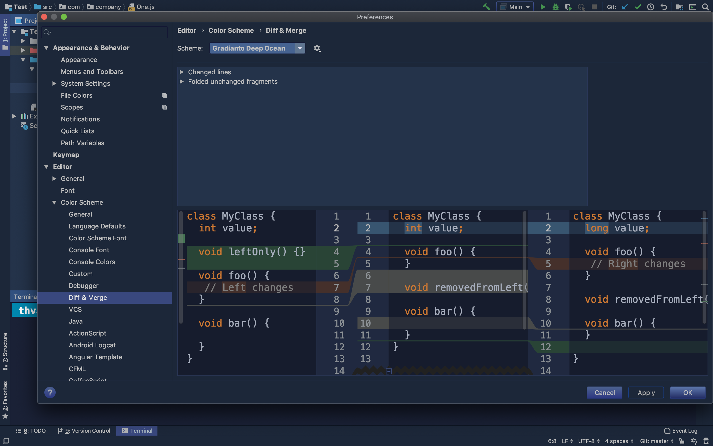
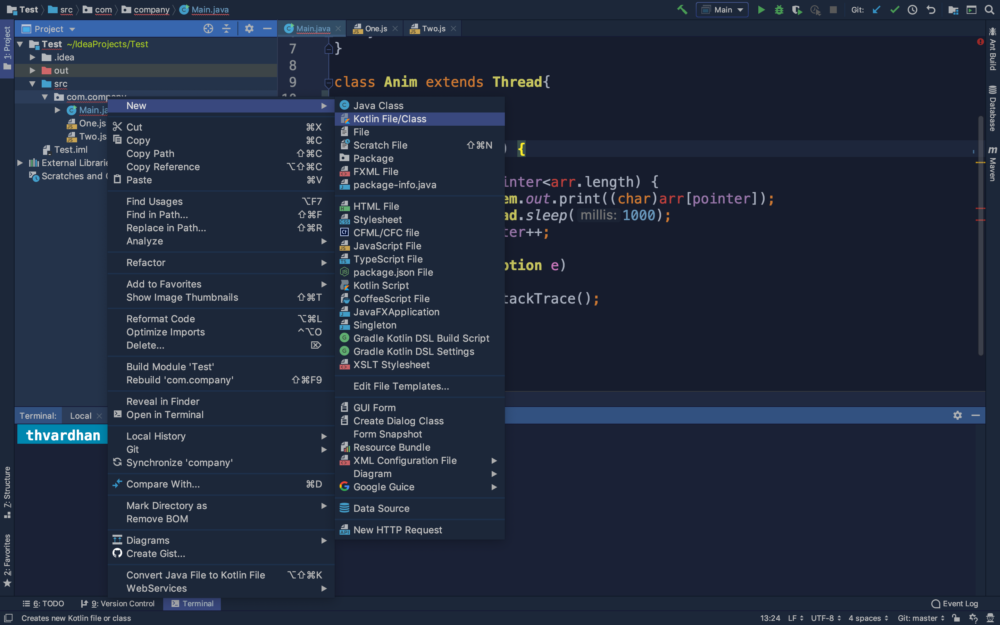
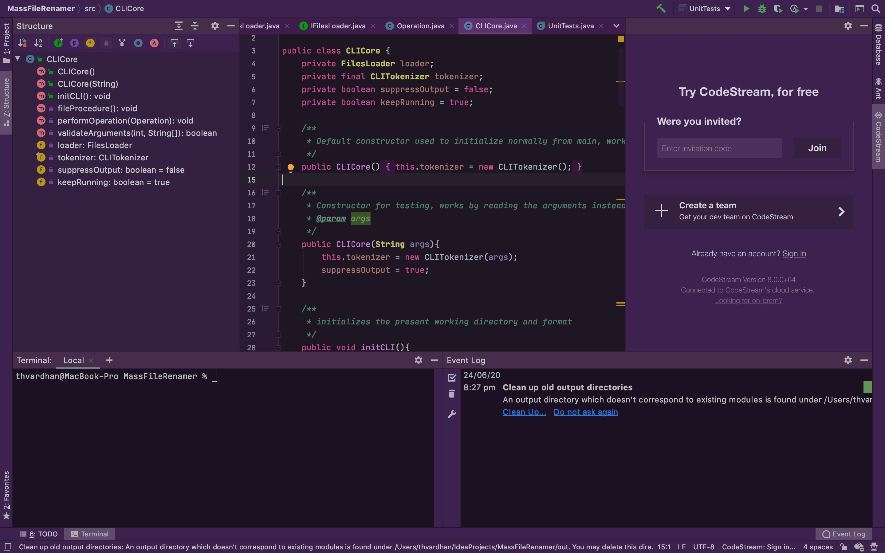
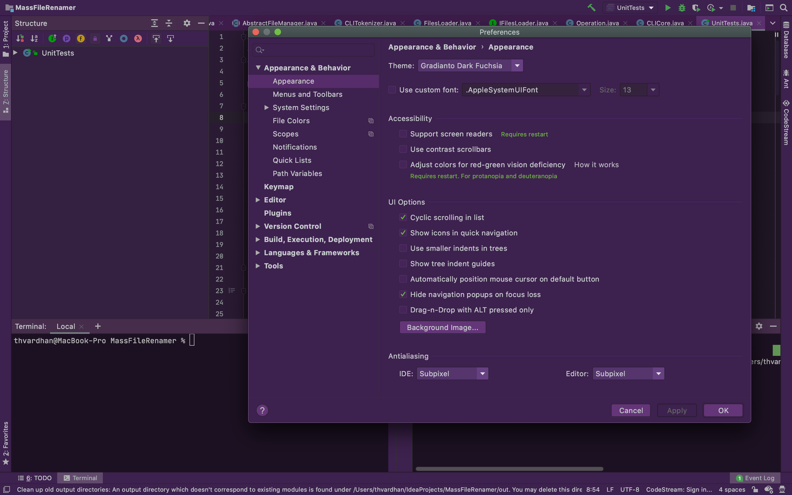
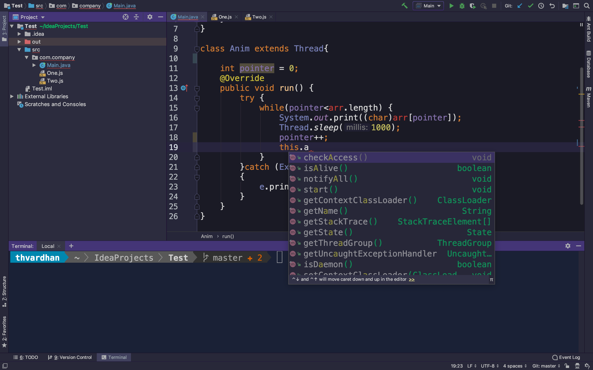
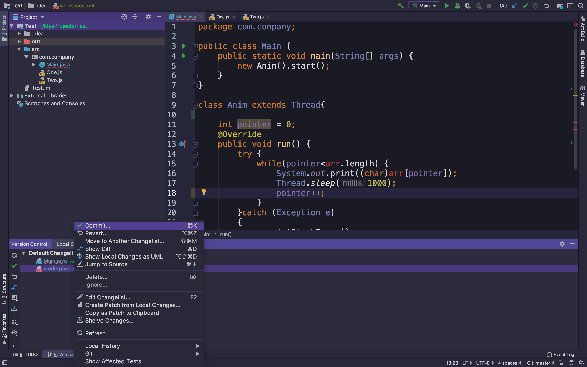

# Gradianto - JetBrains IDE theme
Gradianto aims to be easy on the eyes while being colorful and bright. Gradianto ships with the gradients found in nature. There is something for everyone.
## Winner of Intellij theme contest 2019
With the amazing beauty and elegance of the theme, Gradianto won the Intellij theme contest 2019! Thank you for your support!

## Sponsor

 
Request and perform code reviews from inside your IDE.  Review any code, even if it's a work-in-progress that hasn't been committed yet, and use jump-to-definition, your favorite keybindings, and other IDE tools.  <a title="Try CodeStream" href="https://sponsorlink.codestream.com/?utm_source=jbmarket&amp;utm_campaign=gradianto&amp;utm_medium=banner">Try it free</a>

## Screenshots

## FAQ
<ul>
<li>
How to use the theme in EAP?
<ul>
<li>
    If you have already installed Gradianto on a non-EAP version of Intellij and switch to EAP then it might not work for you out of the box.
    Reinstalling the plugin from the marketplace will fix this problem
</li>
</ul>
</li>
<li>
My colors are not correct!
<ul>
<li>
    If you have just applied the theme then it is recommended that you restart your IDE so that the plugin can load proper colors. If there are still inconsistencies then please feel free to open an issue to this repository.
</li>
</ul>
</li>
</ul>

## Installation
1.  Open  `Preferences -> Plugins -> Marketplace (Located in the upper tab)`  and search for  **`Gradianto`**
2.  Install the plugin
3.  Click restart your IDE
4.  Open  `Preferences -> Appearance & Behavior -> Appearance`  and select any one of the gradient of the Gradianto theme in the  **`theme`**  dropdown.
5. Click `Apply` and enjoy the theme.
## Alternative
If you are having trouble with the above method, you may try this :
1. Go to [Gradianto plugin download page](https://plugins.jetbrains.com/plugin/12334-gradianto)
2. Click `Versions`
3. Download the latest Jar file
4. Go to  `Preferences -> Plugins`  
5. click the cog icon at the top
6.  Click  **`Install Plugin from Disk...`**
7.  Select the `JAR` file you downloaded in step 1
8.  Restart your IDE
9.  Open  `Preferences -> Appearance & Behavior -> Appearance`  and select any one of the gradient of the Gradianto theme in the  **`theme`**  dropdown.
10. Click `Apply` and enjoy the theme.
## Building from source
This plugin now uses gradle build procedure. The detailed guide on how to build the plugin from source is available at the following link https://www.jetbrains.org/intellij/sdk/docs/tutorials/build_system/prerequisites.html